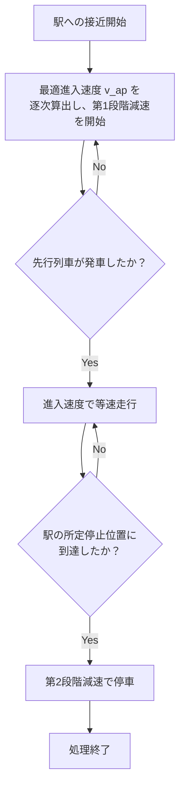

# 駅間停車抑制を目的とした2段階減速アルゴリズムの提案と検証 — 発表スライド草案（Markdown）

> スライドは図中心。各スライドの末尾に「話すポイント」を付けています。図は「何を見せるか」「どう作るか（軸・注記）」まで具体化しています。出典ページは`./論文.pdf`の該当箇所です。

---

## 1. タイトル（0.25分）

**駅間停車抑制を目的とした2段階減速アルゴリズムの提案と検証**
佐藤 駿一＊，福田 卓海，高橋 聖，中村 英夫（日本大学）

* 図：なし

**話すポイント**
・たいとるを読み上げる。

---

## 2. 背景①：都心部の鉄道輸送の現状（0.5分）

**図の構成（左右2分割）**

* **左側：都心部の課題**
  - 高頻度運転の需要：朝ラッシュ時の大量輸送
  - 慢性的な遅延：わずかな遅延が連鎖的に拡大
  - 運行密度の限界：既存インフラでの容量制約

* **右側：移動閉塞の導入背景**
  - 従来の固定閉塞では限界
  - リアルタイム制御による高密度運転
  - しかし遅延波及問題は未解決

**強調メッセージ**
- 下部に「**移動閉塞導入後も駅間停車による遅延拡大が課題**」を赤文字で表示

**出典**：都心部鉄道の現状と課題（序論・背景）。

**話すポイント**
・都心部では高密度運転が求められるが、慢性的な遅延が課題。
・移動閉塞システムが導入されても、遅延波及による駅間停車問題は解決されていない。

---

## 3. 背景②：固定閉塞と移動閉塞（0.25分）

**図の構成（左右2分割の概念図）**

* 左：「固定閉塞」：色分けしたブロック＋信号。列車間隔＝ブロック長で頭打ち。
* 右：「移動閉塞（CBTC/ATACS）」：先行列車後端＋安全余裕長で動的に許容領域を描画（半透明帯）。
* 下に短い注記：「移動閉塞＝リアルタイム位置・速度で安全距離を動的算出 → 高頻度運転に有利」

**作図のコツ**
軸不要のアイソメ図／線路は1本、列車は矩形。安全余裕は半透明帯で可視化。
**出典**：背景説明と移動閉塞の要点（p.2 〈2･1〉，関連研究 p.2 〈2･2〉）。

**話すポイント**
・移動閉塞は列車性能に応じて間隔を縮められるが，遅延波及下では駅間停車が頻発する課題が残る。

---

## 4. 背景③：遅延波及と駅間停車のデメリット（1分）

**図A：時間‐位置（Time–Space）小図**

* 2本の列車の時空間図。先行列車が駅で長停車→後続が駅手前で水平（停止）になる例。
* 右肩に「旅行時間増」「再加速によるエネルギー増」「乗り心地/運行安定性の悪化」と箇条書き。

**図B：エネルギー直感図**

* 「完全停止→再加速」がエネルギー多消費である概念図（棒グラフ2本：惰行再加速＜完全停止再加速）。

**出典**：背景（p.1 末〜p.2 の議論）。結論のエネルギー考察（p.6 上段）。

**話すポイント**
・駅間停止は時間・エネルギー・安定性の全てに悪影響。

---

## 5. 目的・研究の位置づけ（1分）

**図：左右2分割の構成**

* **左側：従来手法の限界**
  - 単純な早期減速 → 旅行時間増大・遅延回復能力の喪失（赤色）
  - 通常運転 → 駅間停車頻発（赤色）

* **右側：本研究の目的**
  - **3つの要求を同時に満足**
    * 駅間停車抑制（緑色）
    * 旅行時間延長の抑制（緑色）
    * 遅延回復能力の維持（緑色）

**解決手段**
- 中央下部に「**方法: 2段階減速アルゴリズムによる実用的な解決策**」を強調表示

**出典**：要旨・序論（p.1），研究目的の明確化（p.1 最後〜p.2，p.6）。

**話すポイント**
・従来手法では3つの要求を同時に満たすことが困難。
・本研究は2段階減速アルゴリズムによる実用的な解決策を提案。
・色分けにより課題（赤）と目標（緑）を明確に区別。
・本研究は2段階減速により、駅間停車を抑制しつつ旅行時間悪化を防ぎ、安全性と遅延回復能力を両立する。
・移動閉塞システムの利点を最大化する実用的なアルゴリズムを提案。

---

## 6. 提案手法：モデル化（数理モデル）

**図A：2列車モデルの模式図（左）**
* 列車1（青色・先行）が駅から出発、列車2（赤色・後続）が駅に到着する状況
* 初期モデルの概要図

**図B：時間-距離グラフ（右）**
* 列車の軌跡を時間-距離平面で表現
* 軸：横=時間\[s]，縦=距離\[m]

**数理モデル**
* 状況：列車1が駅から出発、列車2が駅に到着
* 意思決定変数：列車2の加速度 $a_2$
* 速度/加速度制約：$0\le v\le v_{\max},\ -a_{\mathrm{brake,max}}\le a\le a_{\max}$

**出典**：モデル定義・式(1)〜(12)・図1（p.2–3）。

**話すポイント**
・2列車の相互作用を考慮した理想化モデルで安全な接近を設計。

---

## 7. 提案手法：モデル制約

**安全制約の詳細説明**

**主要な制約条件**
* **安全距離制約**：$x'_1(t;z) \ge x_2(t)+d_2(t)+L_{\mathrm{safe}}$
  - $x'_1(t;z)$：先行列車1の後端位置
  - $x_2(t)$：後続列車2の前端位置  
  - $d_2(t)$：列車2の制動距離
  - $L_{\mathrm{safe}}$：安全余裕長

**制約の意味**
* 先行列車の後端と後続列車が必要な制動距離＋安全余裕を保つ
* リアルタイムでの位置・速度情報に基づく動的制約

**出典**：安全制約の定義（p.2-3）。

**話すポイント**
・移動閉塞システムの核心である動的安全距離を数式で表現。
・制動距離と安全余裕を考慮した実用的な制約設定。

---

## 9. 提案手法③：2段階減速の考え方（1段比較付き）

**図A：速度‐時間グラフ（1段 vs 2段）**

* 1段減速：駅手前で一括ブレーキ→低速長時間 or 停止が生じやすい。
* 2段減速：第1段で進入速度を整え等速，駅に入れるタイミングで第2段ブレーキで停止。
* 第1段の終了条件＝「先行列車の出発」を縦破線で示す。

**図B：列車2の走行パターン例（簡易版）**

* p.4 図2の要点（第1段減速→等速→第2段減速）を簡潔に再現。
* 軸：横=時間，縦=速度。区間名と切替点に注記。

**出典**：2段階減速の定義と図2（p.4）。

**話すポイント**
・第1段は「進入速度の設定」、第2段は「停止のための最終制動」。

---

## 10. 提案手法④：最適進入速度と事前減速（鍵式）

**図A：式と幾何の関係（小窓）**

* 進入速度 $v_{\mathrm{ap}}$ と位置の関係：

  $$
    d'_2=\frac{v_{\mathrm{ap}}^2+2a_{\max}L_{\mathrm{train}}}{2a_{\max}},\quad
    v(x)=\sqrt{\frac{2a_{\max}a_{\mathrm{brake,max}}(x+L_{\mathrm{train}})}{a_{\max}+a_{\mathrm{brake,max}}}}
  $$

  （式(14)(16)を見やすく掲示。詳細導出は口頭）

**図B：アルゴリズム・フローチャート**

**出典**：最適進入速度の導出・式(14)(16)と事前減速の導入（p.4）。

**話すポイント**
・発車時刻の不確実性には「逐次最適化＋事前減速」で対応し，極端な低速滞留を避ける。

---

## 11. シミュレーション方法（環境）

**図：条件ボックス＋模式図**

* 区間：実路線を模した約24 km。
* 列車本数：40本（朝ラッシュ，慢性的遅延を反映）。
* 走行：指示速度＋車両性能＋線路条件（カーブ/勾配）で数値計算。
* 比較：**基準モデル**（安全制約内で可能な限り接近，特別な速度調整なし） vs **提案モデル**（2段階減速＋事前減速）。
* 右に路線模式（駅列）とシミュレーションの入出力（ダイヤ・遅延時系列 → 走行軌跡/エネルギー）。

**出典**：シミュレーションモデルの記述（p.5 〈5･1〉）。

**話すポイント**
・「実務的な朝ラッシュ設定」で効果を比較。

---

## 12. シミュレーション分析（挙動の違い）

**図A：全体の時空間図（基準=青，提案=赤）**

* p.5 図5を再現。提案はダイヤに大きく逸脱せず追随。

**図B：駅周辺の拡大図**

* p.5 図6を再現。基準で駅手前停止が発生，提案は低速維持でスムーズに進入。

**キャプション例**

* 「図A：全体の走行パターン—提案は大きく逸脱なし」
* 「図B：駅周辺の挙動—提案は完全停止を回避」

**出典**：図5・図6と本文解説（p.5 〈5･2〉）。

**話すポイント**
・提案は停車を避けつつダイヤ追随性と回復能力を保持。

---

## 13. シミュレーション結果の定量評価

**図A：駅間停車時間（棒グラフ）**

* 棒2本：基準 600 s，提案 113 s。上に削減率（参考：表現は「大幅削減」とし，口頭で数値）。
* **注**：本文では「約72%削減」との記述，結論では「約55%」とも書かれているが，**表1の集計値は 600→113 s**。発表では「表の絶対値」を主に示す。

**図B：総消費エネルギー（棒グラフ）**

* 棒2本：基準 5874 kWh，提案 5815 kWh（ほぼ同等，微減 ≈0.2%）。

**小表（右下に並置）**

* 表1／表2の数値を転記（出典明記）。

**出典**：表1・表2（p.5 〈5･3〉），エネルギー考察（p.6）。

**話すポイント**
・駅間停車時間は大幅に減り，**エネルギーは悪化せず**（むしろ微減）。

---

## 14. まとめ（0.5分）

**図：チェックリスト風まとめ＋今後の課題**

* ✅ 移動閉塞環境の2列車モデルで安全制約下の接近条件を整理。
* ✅ **2段階減速＋事前減速**で停車を抑制し，旅行時間・回復能力とのバランスを確保。
* ✅ シミュレーション（24 km・40本）で**駅間停車の大幅削減**と**エネルギー悪化なし**を確認。
* ➡ 今後：勾配・曲線抵抗を含む詳細車両モデル／多列車相互作用へ拡張。

**出典**：結論（p.6）。

**話すポイント**
・運行信頼性向上に向け，既存ダイヤ大変更なしで適用可能な制御方策。

---

# 補足：図の制作ノート（発表準備用）

* **配色**：基準=青，提案=赤（本文図と対応）。凡例を必ず入れる（色覚多様性を考慮して破線/点線も併用）。
* **軸と単位**：時間\[s]・位置\[m]・エネルギー\[kWh]を明示。
* **式の扱い**：安全制約と2式（(14)(16)）のみを小さく掲示。導出は口頭。
* **キャプション**：各図に「何を比較／主張する図か」を一文で。
* **注記**：定量結果は\*\*表の数値（600 s / 113 s，5874 / 5815 kWh）\*\*を主表示。削減率は口頭補足に留める（本文の記述差異に配慮）。

---

# 参考：本文・図表の対応（スライド作図時の出典ラベル）

* **背景と目的**：p.1–2（要旨・〈2･1〉〈2･2〉）。
* **モデル化**：式(1)–(12)，図1（p.2–3）。
* **2段階減速・事前減速**：図2，式(14)(16)（p.4）。
* **挙動比較**：図3・図4（p.4），図5・図6（p.5）。
* **定量結果**：表1・表2（p.5），エネルギー考察（p.6），総括（p.6）。

---

## 口頭スクリプトの目安（計約5分）

* タイトル(0:15) → 背景①(0:15) → 背景②(1:00) → 目的(1:00) → 手法(1:30) → 解析/結果(0:45) → まとめ(0:15)

> ※ 図の再現にあたっては、**p.4 図3/図4、p.5 図5/図6、p.5 表1/表2**を基準にしつつ、必要に応じて解像度や注記を発表用に最適化してください。
