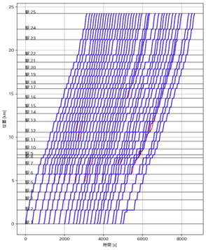
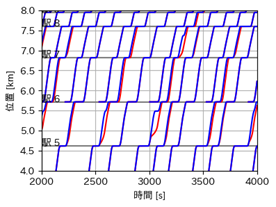

<!--
_class: 'title'
 -->
<!-- タイトルページ -->

# 駅間停車抑制を目的とした 2段階減速アルゴリズムの 提案と検証

**佐藤 駿一$^*$，福田 卓海，高橋 聖，中村 英夫**
日本大学

---
<!-- 
_class: section-title
 -->
<!-- セクションのタイトルと目次 -->
# 概要

- 
背景と課題

- 提案手法
- シミュレーション
- 結果と評価
- まとめ

---

# 背景：都心部の鉄道輸送の現状

## 都心部の通勤路線の課題
- **高頻度運転の需要**：朝ラッシュ時の大量輸送
- **運行密度の限界**：既存インフラでの容量制約

- **慢性的な遅延の発生**
**遅延証明書の発行（平日20日）** : 平均11.7日　最大19.0日

---

# 背景：固定閉塞と移動閉塞

    
    

        

            
            
固定閉塞

        

        

            
            
移動閉塞（CBTC/ATACS）

        

    

 

**移動閉塞** = リアルタイム位置・速度で安全距離を動的算出 → 高頻度運転に有利

**課題**: 遅延波及下では駅間停車が頻発

---

# 背景：遅延波及と駅間停車

    
    
遅延波及による駅間停車

    

## 駅間停車の影響
- **旅行時間増**
- **再加速/エネルギー増**  
- **運行安定性の悪化**

 

**駅間停止は時間・エネルギー・安定性の全てに悪影響**

---

# 目的・研究の位置づけ

## 従来手法の限界
- **単純な早期減速**
→ 旅行時間増大
→ 遅延回復能力の喪失
- **通常運転**
→ 駅間停車頻発 

## 本研究の目的
**3つの要求を同時に満足**
-  **駅間停車抑制**
-  旅行時間延長の抑制 
-  遅延回復力能力の維持 

 

**2段階減速アルゴリズムによる実用的な解決策を提案**
**実路線を模倣したシミュレータで検証**

---
<!-- 
_class: section-title
 -->
# 提案手法

- 背景と課題
- 
提案手法

- シミュレーション
- 結果と評価
- まとめ

---

# 提案手法：モデル化

    
    
2列車モデル

    
    
時間-距離グラフ

## 数理モデル
- 状況：列車1が駅から出発、列車2が駅に到着
- 意思決定変数：列車2の加速度$a_2$
- 速度/加速度制約：$0\le v\le v_{\max},\ -a_{\mathrm{brake,max}}\le a\le a_{\max}$

---
# 提案手法：モデル制約

    
    
安全制約

## 安全制約
$$x'_1(t) \ge x_2(t)+d_2(t)+L_{\mathrm{safe}}$$

- $d_2(t)$：列車2の停止までの距離
- $L_{\mathrm{safe}}$：通信遅延や位置誤差を許容できるマージン

---

# 提案手法：2段階減速の考え方

    
    
1段減速 vs 2段減速

## 最適進入速度の算出
- 1段目の減速をしすぎると悪影響
- 適切な侵入速度（等速運転速度）を求める必要がある
- しかし、列車1がいつ発車するのかは予測できない

---

# 提案手法②：最適進入速度

## 2段階アルゴリズム

- 発車時刻の不確実性には「**逐次最適化**」で対応
- 等速運転への切り替えを「**列車1の発車**」とする

graph LR;
    A["駅への接近"] --> B["
$$v_ap$$を逐次算出 $$v_ap$$まで減速
"];
    B --> C{"先行列車が発車したか？"};
    C -- No --> B;
    C -- Yes --> D["進入速度で等速走行"];
    D --> E{"停止位置前に 停車可能か？"};
    E -- Yes --> D;
    E -- No --> F["停車のための 減速"];

---

# 提案手法②：最適進入速度
## 最適進入速度の求め方

 

$$v(x)=\sqrt{\frac{2a_{\max}a_{\mathrm{brake,max}}(x+L_{\mathrm{train}})}{a_{\max}+a_{\mathrm{brake,max}}}}$$

---

# 実際の制御
## 列車2の制御
- 駅から$-x$の時に$v_{ap}(x)$を上回ったらブレーキをかける
    **1段目減速**
- 列車1が出発したら$v_{ap}(x)$で等速運転
    **等速運転**
- 駅に停車可能な位置で減速
    **2段目減速**

---
<!-- 
_class: section-title
 -->
# シミュレーション

- 背景と課題
- 提案手法
- 
シミュレーション

- 結果と評価
- まとめ

---

# シミュレーション方法

## 条件設定
- **区間**：実路線を模した約24 km
- **列車本数**：40本（朝ラッシュ，実路線の遅延を反映）
- **比較対象**：1段減速 vs 提案モデル

    
    
1段減速 vs 提案モデル

---

# シミュレーション分析：挙動の違い

    

        
        
図A：全体の走行パターン

    

    

        
        
図B：駅周辺の挙動

    

**基準**（青）：駅手前停止が発生  
**提案**（赤）：低速維持でスムーズに進入

提案は停車を避けつつダイヤ追随性と回復能力を保持

---
<!-- 
_class: section-title
 -->
# 結果と評価

- 背景と課題
- 提案手法
- シミュレーション
- 
結果と評価

- まとめ

---

# シミュレーション結果の定量評価
## 駅間停車時間とエネルギー比較

表1 定量評価結果

| 項目 | 基準モデル | 提案モデル | 改善率 |
| --- | --- | --- | --- |
| 駅間停車時間 [s] | 600 | 113 | 大幅削減 |
| 総消費エネルギー [kWh] | 5874 | 5815 | ≈0.2%減 |

駅間停車時間は大幅に減り，**エネルギーは悪化せず**

---
<!-- 
_class: section-title
 -->
# まとめ

- 背景と課題
- 提案手法
- シミュレーション
- 結果と評価
- 
まとめ

---

# まとめ

## 本研究の成果
- **2段階減速**で停車を抑制し，旅行時間・回復能力とのバランスを確保
- シミュレーション（24 km・40本）で**駅間停車の大幅削減**と**エネルギー悪化なし**を確認

## 今後の課題
- 勾配・曲線抵抗を含む詳細車両モデルへの拡張
- 多列車相互作用の考慮

---

<!-- 
_class: section-title
 -->
# ご清聴ありがとうございました

